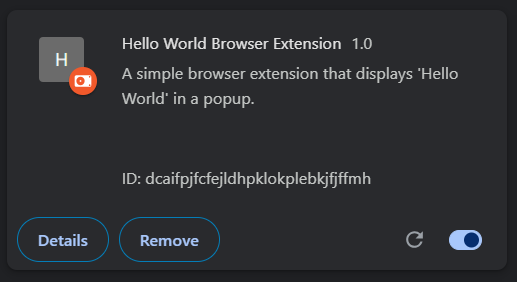
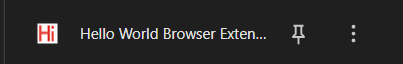
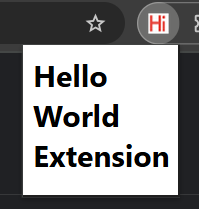

# Helloworld Browser Extension 🌐

A minimalistic browser extension that displays a simple "Hello, World!" message — a foundational project to understand the structure and workflow of web extensions.

## 🚀 Features

- ✅ Displays a custom popup with a **greeting message**
- ✅ Demonstrates the basic structure of a browser extension
- ✅ Clean and beginner-friendly codebase
- ✅ Compatible with Chromium-based browsers (Chrome, Brave, Edge)

## 📁 Project Structure

```bash
Helloworld_Browser_Extension/
├── manifest.json      # Extension metadata
├── popup.html         # HTML for the popup UI
├── popup.css          # Styling for the popup
└── popup.js           # Logic and interactivity
```

## 🧩 How to Use

1. Clone this repository:
   ```bash
   git clone https://github.com/TomSibu/Helloworld_Browser_Extension
   ```

2. Open your Chrome browser and go to `chrome://extensions/`.

3. Enable **Developer Mode** (top right).

4. Click **Load Unpacked** and select the folder you just cloned.

5. Click the extension icon on the toolbar to see the popup!

## 🛠️ Tech Stack

- HTML
- CSS
- JavaScript
- Chrome Extension API

## 🎯 Purpose

This project serves as a **starter template** for anyone looking to learn how browser extensions work. It includes all the basic components needed to extend browser functionality using frontend technologies.

## 📷 Preview





## 📚 Resources

- [Chrome Extension Documentation](https://developer.chrome.com/docs/extensions/mv3/getstarted/)

## 📜 License

This project is licensed under the [MIT License](LICENSE).

---

Made with ❤️ by [Tom Sibu](https://github.com/TomSibu)